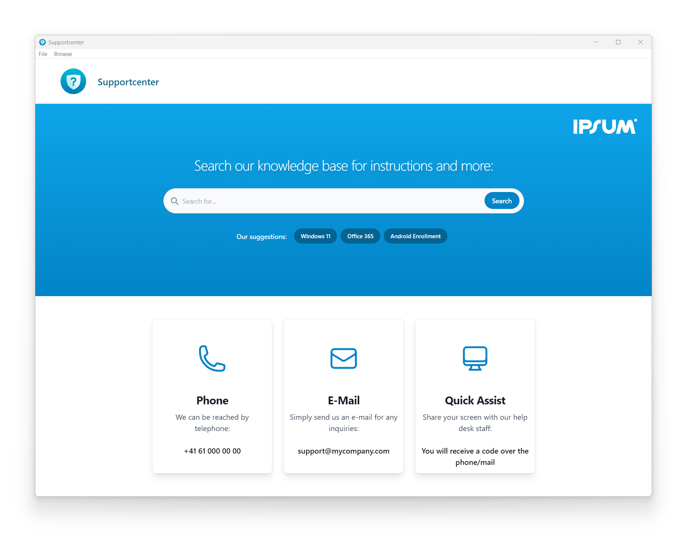

# Supportcenter Framework

<!-- ABOUT THE PROJECT -->
## ℹ️  About The Project
Easily create a single point of IT support with PureBasic, Tailwind CSS and WebView2 (Microsoft Edge)

<!-- GETTING STARTED -->
## 🚀 Getting Started
Customize the file "index.html" in the web/src folder according to your wishes and create an installation (MSI/EXE) from the result using Advanced Installer.
More details will follow.

<!-- LICENSE -->
## 📃 License
Distributed under the MIT License. See `LICENSE.txt` for more information.

<!-- CONTACT -->
## 📧 Contact
TUGI - [contact@tugi.ch](mailto:contact@tugi.ch) 
